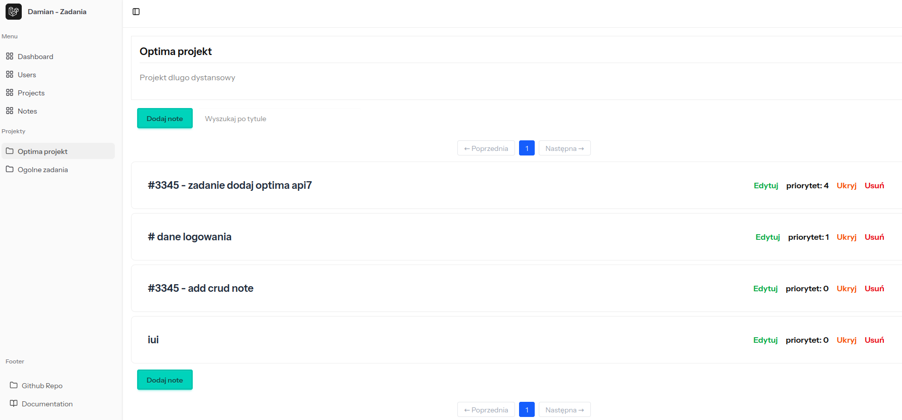

# Task manager

laravel + vue + inertia

Aplikacja na potrzeby zapisu informacji do projektów, jak zadania lub noty




### Project start

start docker

```
docker compose up
```

available server: http://localhost:99

migracja

```
php artisan migrate
php artisan db:seed
```

Wykrywaj zmiany w vue

```
npm run dev
```


### CSS - gotowe komponenty

Wykorzystany jest  tailwindcss + daisyui

https://daisyui.com


# Migration

### Make model set

Shortcut to generate a model, migration, factory, seeder, policy, controller, and form requests...

```
php artisan make:model Project -a
```

### Seeds

```
php artisan db:seed
php artisan db:seed ProjectSeeder
```

### Run migrations

```
php artisan migrate
php artisan make:migration add_some_column

```

rollback 1 migration file

```
php artisan migrate:rollback --step=1
```